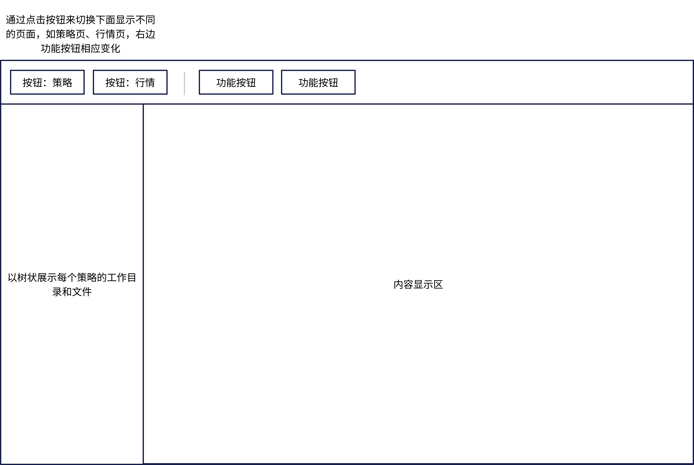

# Quantitative Finance System
 
## 整体架构

整体系统分成三个组件：

1. 数据服务器：提供数据获取与查询功能，用C\+\+开发，使用Websocket++对外提供Restful接口以查询数据。数据通过python从开源库获取，存储在本地时使用SQLite。数据频率为小时。只支持国内市场、股票。
2. 策略服务器：提供策略运行环境，包括账户管理功能（目前主要是模拟，不接入真实的交易接口）、回测功能、统计分析功能。暂定为支持C\+\+与python两种语言编写策略，优先支持C\+\+，每个策略编译为一个dll供服务器调用。python就调用C++的接口。服务器也用C\+\+开发，用Websocket\+\+对外提供接口。
1. 前端：提供UI界面，使用nodejs开发与Elements UI框架。

通过启动器启动三个组件来运行整个系统，系统是持续运行的：

1. 启动数据服务器，等待数据获取完成。
1. 启动策略服务器。
1. 启动前端。

三个组件可以单独运行，相互之间采用Websocket通信，便于重复利用。C\+\+中还有一个Rest SDK可以用来进行通信，不过它只支持Websocket客户端，而没有服务端，可以在请求通信时用。开发中使用最新的C\+\+23标准，x64架构。

## 依赖

### Visual Studio 2022

需要安装C++、Nodejs组件。

### Vcpkg

需要安装的包：

```cmd
.\vcpkg install boost:x64-windows eigen3:x64-windows sqlitecpp:x64-windows cpprestsdk:x64-windows fmt:x64-windows websocketpp:x64-windows spdlog:x64-windows
```

## 数据服务器

### 配置
配置文件为`DataServer-config.json`，配置项如下：

```json
{
    "port": 8080,
    "dbPath": "data.db",
    "startDate":  "2010-01-01"
}
```

### Restful接口

### 实现

1. 每种资产对应一张表，目前只支持国内股票，则表名为`cn-stock`，如果以后加入新的资产，就增加新的表。  
2. 启动时会检验数据完整性，如果不完整，就从startDate开始获取数据。然后周期性地刷新数据。
1. 

## 策略服务器

### 功能与实现

策略服务器是整个系统的核心与难点。目前拟采用的基本框架是提供静态库供编写策略，策略编译为dll后提交给服务器运行，需要确定：策略名称、dll文件、策略配置文件。服务器需要支持参数优化功能，这可以通过get、set来实现，在配置文件中定义待优化的参数名称。还有一个比较麻烦的问题是账户的处理，策略即可以回测模式运行，也可以以实时模式运行，两种模式使用统一的账户，则要求每个策略都需要有一个对应的账户，对于需要参数优化的策略而言，每个参数组都对应一组账户，优化结束后删除没有选中的账户。账户与策略是一一对应的。还需要支持已有的策略通过指定新的config文件来创建新的策略。

每个策略有一个独立的运行环境Context与工作目录，其中存储了该策略已经遍历过的最新时间点，策略服务器会不断检查每个策略并推进相应的时间点。策略向工作目录写文件时先注册一下，这样服务器就能主动获得文件的变化情况并向前端推送。运行环境中的数据包括两种，一是固定的环境变量，通过`env()`来获取，二是策略自己的参数，通过`get()`取得，通过`set()`来修改。环境变量包括：

1. `"config"`：json配置文件。
2. `"ID"`：UUID，此id在上传策略时生成。
1. `"CurrentTime"`：策略已经遍历的最新时间点。
1. `"WorkDir"`:完整的工作目录。

运行环境、策略dll构成了完整、独立的可运行实体。

## 前端

### UI设计

